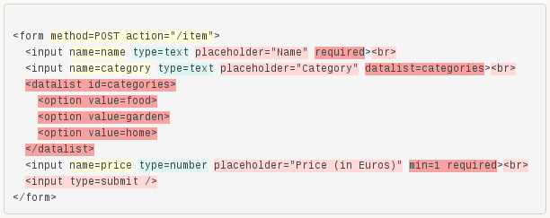
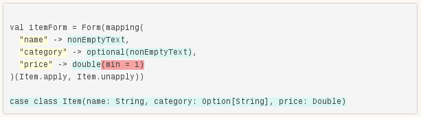

# editors

UI framework for engineering data editors.

## Motivation

Information and communications technologies bring up a lot of power to solve real world problems by providing network infrastructure and computing power to process and share data. Nevertheless, very often humans need to manually enter or edit data, using editors.

To my experience, developing an editor is one of the less productive engineering task. It seems that capitalizing editors code is challenging, probably because several abstraction layers and concerns are involved and entangled: user interface, feedback logic (completion, validation, etc.), data transmission from and to the server and data domain. Consider for instance the following HTML fragment defining a form to enter a shop item description:



The different concerns present in the markup have been highlighted to illustrate how they are entangled. But, besides being entangled, they also are redundant with other parts of the code, on the server side. Consider for instance the corresponding form binder in Play:



It turns out that our markup duplicates information already present in the form binder definition (field names, input types and validation constraints), but also adds its own value (form look and placeholders). Similarly, it turns out that the form binder definition almost duplicates information already present in the case class definition (field types) but also adds its own value (validation constraints).

How to reuse the information that is already available in the case class definition in order to define the form binder by supplying only the missing parts? Similarly, how to reuse the information already available in the form binder in order to define the form markup by supplying only the missing parts?

What if we could engineer a data editor just from the data domain definition? We could then bootstrap our application very quickly and progressively enhance it with the missing information related to the validation and presentation concerns.

## Quick start

This section shows how to engineer the same editor as in the previous section, but without duplicating information. We will start by generating a basic editor and show how to enhance it progressively.

### Generate a basic editor

Back to our example, a basic editor can be generated with just the following code:

```scala
case class Item(name: String, category: Option[String], price: Double)

object ItemEditor extends Editors with SimpleUi {
 val editor = Editor.gen[Item]
}
```

The HTML markup of the editor can be retrieved using its `ui` field, and the binding process can be achieved using its `bind` member:

```scala
object Items extends Controller {
  val form = Action {
    Ok(ItemEditor.editor.ui(routes.Items.create))
  }
  val create = Action { request =>
    ItemEditor.editor.bind(request) match {
      case Success(item) => Ok(s"Item created: ${item.name}")
      case Failure(errors) => BadRequest(s"Error: $errors")
    }
  }
}
```

The library inspects the `Item` type at compile-time (using a macro) and try to generate a data binder and form input fields, based on the case class fields, their name and their type. The generated markup looks like the following:

```html
<form method="POST" action="/items">
  <input name="name" type="text" placeholder="Name" />
  <input name="category" type="text" placeholder="Category" />
  <input name="price" type="number" placeholder="Price" />
  <input type="submit" />
</form>
```

And the Play form binder would look like the following:

```scala
Form(mapping(
  "name" -> nonEmptyText,
  "category" -> optional(nonEmptyText),
  "price" -> double
))
```

### Customize the keys used by the input fields

The generator derives the input field names from the case class member names. However, in some cases you want to customize the input names used in the form (for technical reasons, usually). This is possible by defining the following implicit instance of `Key[Item]`:

```scala
implicit val itemKeys = Key.fields[Item](name = "item_name", category = "item_category", price = "item_price")
```

The `Key.fields[Item]` function (generated by a macro) takes named parameters with the same names as the case class `Item` fields. It is possible to customize only one field key:

```scala
implicit val itemKeys = Key.fields[Item](category = "section")
```

### Add validation rules

In order to avoid to reinvent the wheel, you can use whatever validation system you want. The examples below use the new Play! validation API.

Data validation is considered to be part of the data mapping process: data can be mapped from form inputs only if their content is valid. By default, no validation rule is applied: the system just tries to coerce the input to the target field type.

The following code defines the validation rule for the `price` field:

```scala
implicit def itemMapping(implicit Double: Mapping[Double]) =
  Mapping.fields[Item](price = Double >>> min(1.0))
```

The other fields are left untouched, by default the UI generator assumes that fields of type `Option[_]` are not mandatory.

### Add presentational information

#### Choose a theme

The `Ui[A]` typeclass is responsible of generating the editor HTML markup. Default instances are provided in the `Ui` companion object, generating input fields for common types. Using another theme is as simple as extending the trait defining it. Consider for instance the following code using a theme producing markup compatible with [Twitter Bootstrap](http://getbootstrap.com/):

```scala
object ItemEditor extends Editors with TwitterBootstrapUi {
  val editor = Editor.gen[Item]
}
```

#### Set per field presentational information

Each theme can have its own characteristics (use labels or placeholders, use a hint text, etc.), and, within a given theme, you can set per field information (label, hint, etc.):

```scala
implicit val itemPresentation =
  Presentation.fields[Item](
    name = FieldPresentation(placeholder = "Name"),
    category = FieldPresentation(placeholder = "Category"),
    price = FieldPresentation(placeholder = "Price (in Euros)")
  )
```

#### Add field specific markup

By default the UI markup generation is type directed (using the `FieldUi[A]` typeclass) but you can completely customize the markup for just one field or for your whole type:

```scala
implicit def itemUi(implicit Key: Key[Item]) =
  Ui.fields[Item](
    name = FieldUi { field =>
      inputText(field, "datalist" -> "categories") ++ <datalist id="categories">
        <option value="food" />
        <option value="garden" />
        <option value="home" />
      </datalist>
    }
  )
```

The above code uses UI combinators functions to generate markup consistent with the selected theme. Each theme is responsible of defining such combinators.

## Installation

```scala
libraryDependencies += "com.julienrf" %% "editors" % "0.1-SNAPSHOT"
```

## Build from sources

Clone the source code and run sbt from the repository root directory:

```sh
$ git clone git@github.com:julienrf/editors.git
$ cd editors
$ sbt
```

Run the tests:

```
> test
```

Or run a sample:

```
> project sample-backlog
[sample-backlog] $ run
```
